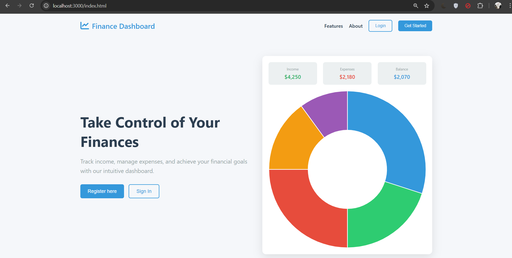
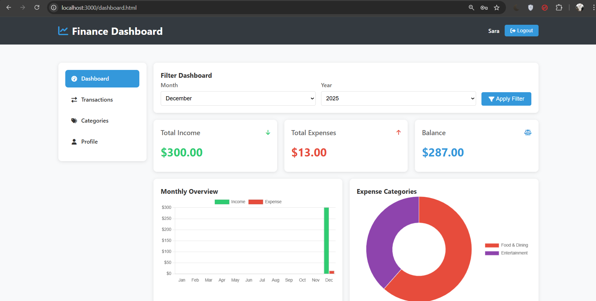
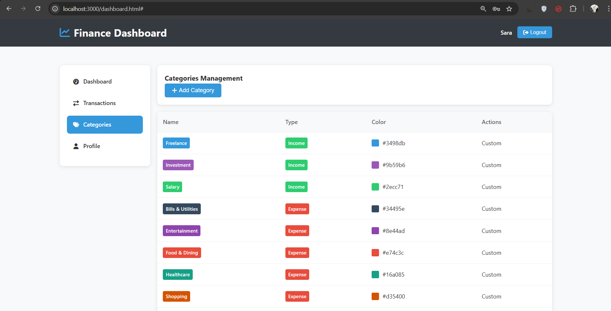

Personal Finance Dashboard

A full-stack **Personal Finance Dashboard** developed as part of **Task 2**.
This web application helps users track income and expenses, categorize transactions, and visualize financial data through an interactive dashboard with secure authentication.

---

## 📸 Screenshots

### Login Page



### Dashboard Page



### Transactions Page


### Categories Page



---

## 📖 Project Description

The **Personal Finance Dashboard** is a database-driven full-stack web application built using **Node.js, Express.js, MySQL, and JWT authentication**.
It allows users to manage their personal finances by recording income and expenses, organizing them into categories, and analyzing monthly financial trends through charts.

This project demonstrates practical implementation of **authentication, authorization, REST APIs, database design, and data visualization**.

---

## ✨ Features

### User Module

* User registration and login
* Secure JWT-based authentication
* Add income transactions
* Add expense transactions
* Categorize income and expenses
* View recent transactions
* Edit and delete transactions
* Filter transactions by date, type, and category

### Dashboard Module

* Total income summary
* Total expenses summary
* Current balance calculation
* Monthly income vs expense chart
* Category-wise expense chart
* Monthly and yearly filters

---

## 🛠 Technologies Used

### Backend

* Node.js
* Express.js
* MySQL
* JWT (JSON Web Token)
* bcryptjs

### Frontend

* HTML5
* CSS3
* JavaScript (Vanilla JS)
* Chart.js
* Font Awesome

### Tools

* Git & GitHub
* Postman
* phpMyAdmin
* VS Code

---

## 📂 Project Structure

```
FINANCE-DASHBOARD/
│
├── database/
│   └── finance_dashboard.sql
│
├── public/
│   ├── index.html
│   ├── login.html
│   ├── register.html
│   ├── dashboard.html
│   ├── styles.css
│   └── dashboard.css
│
├── .env
├── package.json
├── package-lock.json
├── server.js
└── README.md
```

---

## 🗄 Database Design

The application uses a **MySQL database** with the following tables:

* `users` – stores user account details
* `categories` – stores income and expense categories
* `transactions` – stores all financial transactions

### Database Highlights

* User-specific categories
* Category-wise expense calculation
* Monthly aggregation queries for dashboard analytics

The complete SQL schema is included in
`database/finance_dashboard.sql`.

---

## ⚙️ Environment Variables

Create a `.env` file in the root directory:

```env
JWT_SECRET=your_secret_key
PORT=3000
```

---

## ▶ How to Run the Project

### 1️⃣ Clone the Repository

```bash
git clone https://github.com/your-username/finance-dashboard.git
cd finance-dashboard
```

### 2️⃣ Install Dependencies

```bash
npm install
```

### 3️⃣ Setup Database

* Open **phpMyAdmin**
* Create a database named `finance_dashboard`
* Import `database/finance_dashboard.sql`

### 4️⃣ Start the Server

```bash
node server.js
```

Server will run at:

```
http://localhost:3000
```

---

## 🔐 Authentication & Security

* Passwords are securely hashed using **bcrypt**
* JWT-based authentication
* Protected API routes using middleware
* User-specific data access control

---

## 📡 API Overview

| Method | Endpoint                          | Description                 |
| ------ | --------------------------------- | --------------------------- |
| POST   | `/api/register`                   | User registration           |
| POST   | `/api/login`                      | User login                  |
| GET    | `/api/categories`                 | Get user categories         |
| POST   | `/api/categories`                 | Add new category            |
| POST   | `/api/transactions`               | Add transaction             |
| GET    | `/api/transactions`               | View transactions           |
| PUT    | `/api/transactions/:id`           | Update transaction          |
| DELETE | `/api/transactions/:id`           | Delete transaction          |
| GET    | `/api/dashboard/summary`          | Dashboard summary           |
| GET    | `/api/dashboard/monthly-overview` | Monthly overview chart data |
| GET    | `/api/user/profile`               | User profile                |

---

## 📚 Learning Outcomes

* Full-stack web application development
* RESTful API design
* JWT authentication & authorization
* Secure password handling
* MySQL queries and aggregations
* Chart-based data visualization
* Real-world financial data management

---

## 👩‍💻 Developed By

**Girisaa Priyadharsini M**
Task 2 – Personal Finance Dashboard

---

## 📄 License

This project is developed for **educational and internship purposes only**.

---
